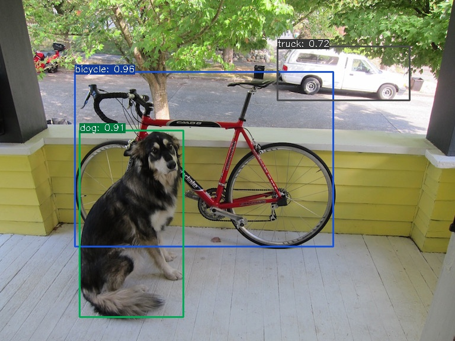

# Yolox C++ TensorRT
Yolox inference with NMS layer.


## Usage 
- Convert onnx file to trt engine 
```console 
user@ubuntu:~$ trtexec --onnx=yolox.onnx --saveEngine=yolox.trt 
```` 
- In main.cpp
```cpp
std::string engine_path = "/your/engine/path/yolox.trt"; 

//Yolo yolo(engine_path, redis_hostname, redis_port);
Yolo yolo(engine_path, "localhost", 6379);
```

- Build 
```console 
user@ubuntu:~$ cd yolo 
user@ubuntu:~$ mkdir build && cd build 
user@ubuntu:~$ cmake ../ 
user@ubuntu:~$ make 
```

## Inference 
- image
```console
user@ubuntu:~$ ./yolo --image image_path.jpg output_path.jpg
```

- video 
```console
user@ubuntu:~$ ./yolo --video video_path.mp4 output_path.avi
```

